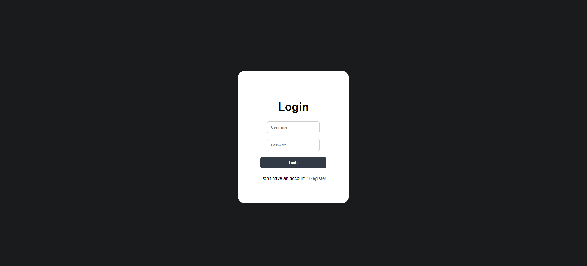
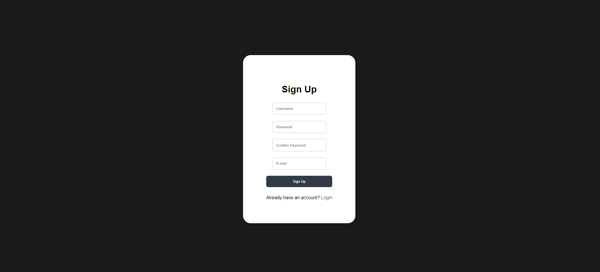
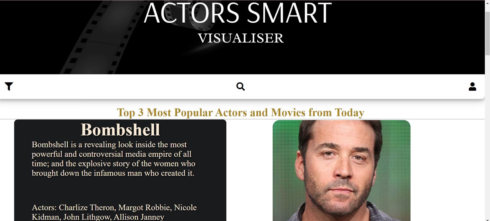
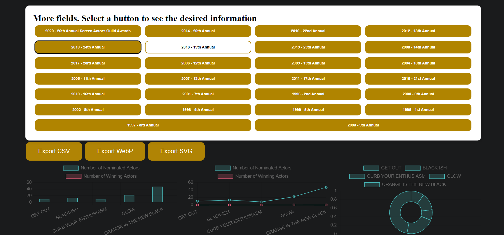
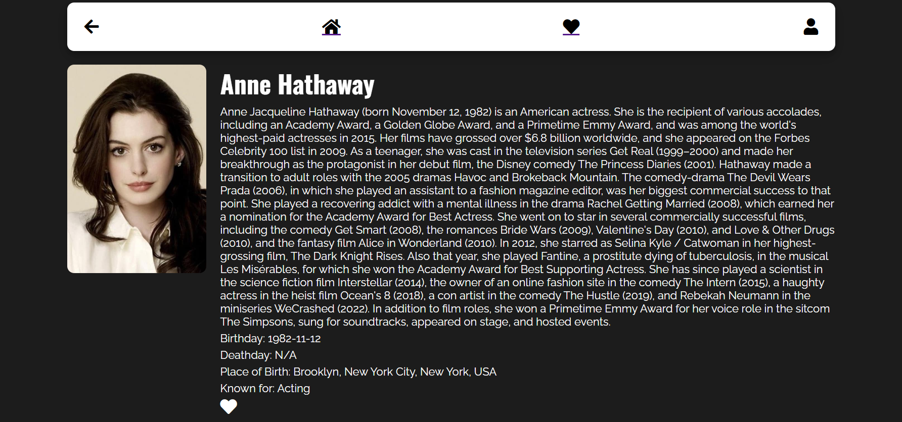
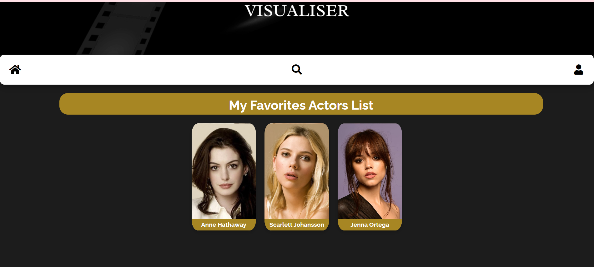
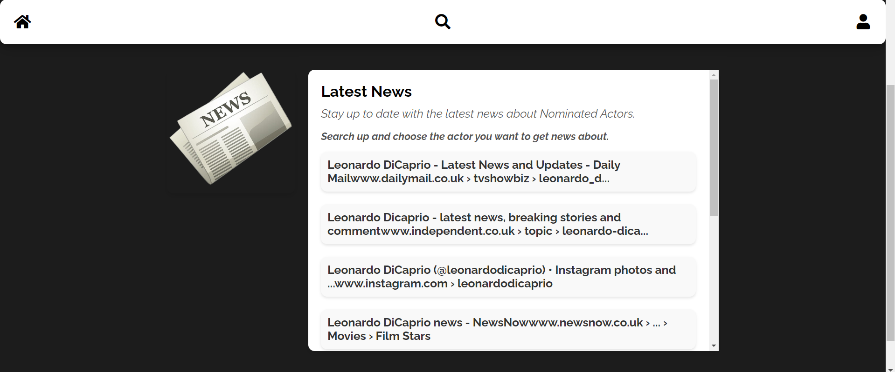
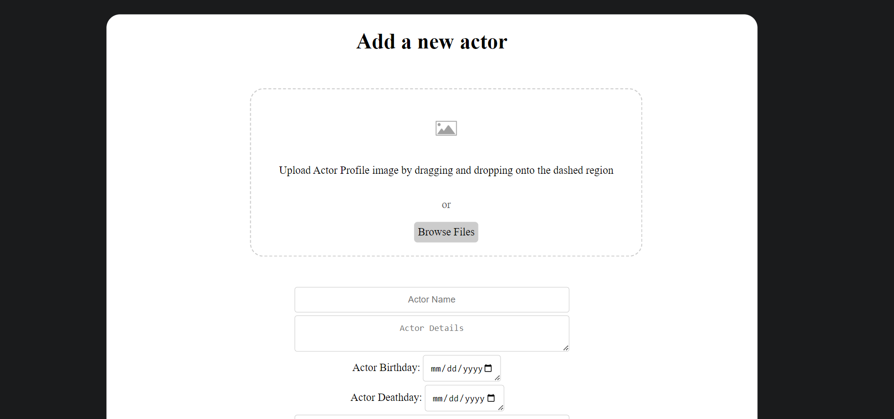
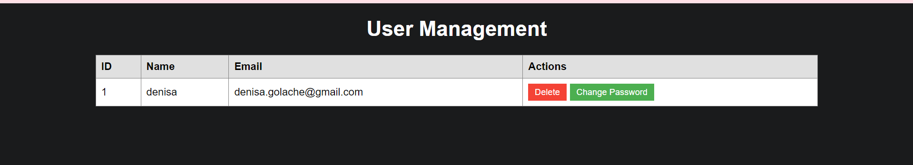
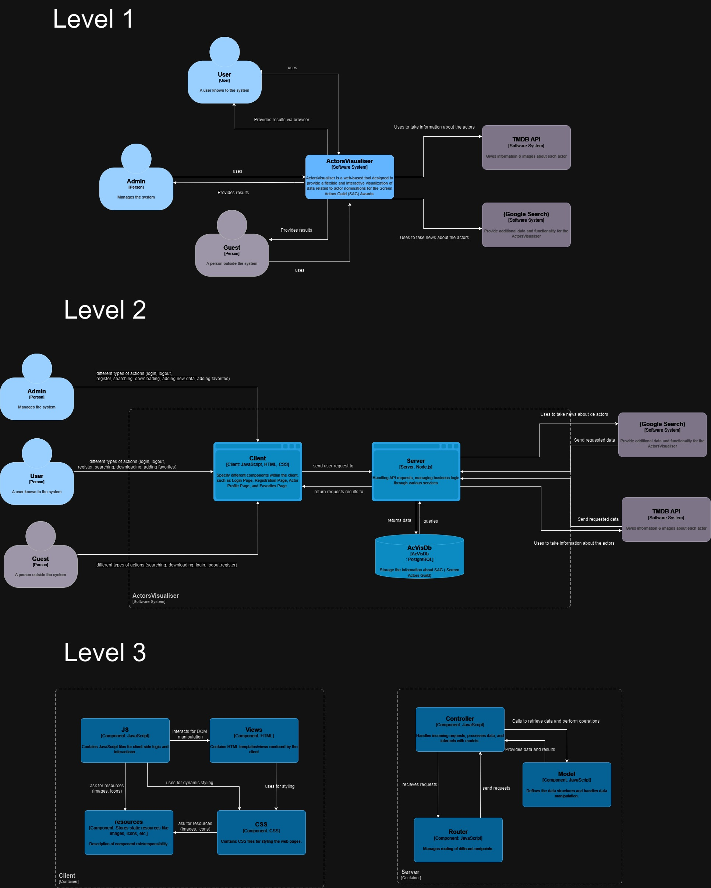

<!DOCTYPE html>
<html lang="ro">
<head>
    <meta charset="UTF-8">
</head>
<body>
<article>
    <header>
        <h1>AcVis (Actors Smart Visualiser)</h1>
    </header>
    <h2>Cuprins</h2>
    <ul>
        <li><a href="#authors">Autori</a></li>
        <li>
            <a href="#introduction">1. Introducere</a>
            <ul>
                <li><a href="#introduction-purpose">1.1 Scop</a></li>
                <li><a href="#conventions">1.2 Convenție de scriere</a></li>
                <li><a href="#audience">1.3 Publicul țintă</a></li>
                <li><a href="#product-scope">1.4 Scopul produsului</a></li>
                <li><a href="#references">1.5 Referințe</a></li>
            </ul>
        </li>
        <li>
            <a href="#overall">2. Descriere Generală</a>
            <ul>
                <li><a href="#product-perspective">2.1 Perspectiva produsului</a></li>
                <li><a href="#product-functions">2.2 Funcțiile produsului</a></li>
                <li><a href="#users">2.3 Clase și caracteristici ale utilizatorilor</a></li>
                <li><a href="#operating-environment">2.4 Mediul de operare</a></li>
                <li><a href="#documentation">2.5 Documentația pentru utilizator</a></li>
            </ul>
        </li>
        <li>
            <a href="#external">3. Interfețele aplicației</a>
            <ul>
                <li><a href="#user-interface">3.1 Interfața utilizatorului</a>
                    <ul>
                        <li><a href="#nav-bar">3.1.1 Bara de navigație</a></li>
                        <li><a href="#login-page">3.1.2 Pagina de autentificare</a></li>
                        <li><a href="#signup-page">3.1.3 Pagina de înregistrare</a></li>
                        <li><a href="#home-page">3.1.6 Pagina de acasă</a></li>
                        <li><a href="#learning">3.1.7 Pagina de statistică a informațiilor suplimentare referitoare la fiecare actor și producție cinematografică</a></li>
                        <li><a href="#rules">3.1.8 Pagina de profil a actorului</a></li>
                        <li><a href="#signs">3.1.9 Pagina cu actorii favoriți</a></li>
                    </ul>
                </li>
                <li><a href="#hardware-interface">3.2 Interfața Hardware</a></li>
                <li><a href="#software-interface">3.3 Interfața Software</a></li>
                <li><a href="#communication-interface">3.4 Interfața de comunicare</a></li>
            </ul>
        </li>
        <li>
            <a href="#system-features">4. Caracteristici ale sistemului</a>
            <ul>
                <li>
                    <a href="#management">4.1 Gestionarea contului</a>
                    <ul>
                        <li><a href="#management-1">4.1.1 Descriere și generalități</a></li>
                        <li><a href="#management-2">4.1.2 Actualizarea informațiilor</a></li>
                        <li><a href="#management-3">4.1.3 Condiții de funcționare</a></li>
                    </ul>
                </li>
                <li>
                    <a href="#utilizatori">4.2 Secțiunea Utilizatori</a>
                    <ul>
                        <li><a href="#utilizatori-1">4.2.1 Descriere și generalități</a></li>
                        <li><a href="#utilizatori-2">4.2.2 Actualizarea informațiilor</a></li>
                        <li><a href="#utilizatori-3">4.2.3 Condiții de funcționare</a></li>
                    </ul>
                </li>
                <li>
                    <a href="#administrator">4.3 Secțiunea Admin</a>
                    <ul>
                        <li><a href="#administrator-1">4.3.1 Descriere și generalități</a></li>
                        <li><a href="#administrator-2">4.3.2 Actualizarea informațiilor</a></li>
                        <li><a href="#administrator-3">4.3.3 Condiții de funcționare</a></li>
                    </ul>
                </li>
            </ul>
        </li>
        <li>
            <a href="#non-functional">5. Funcționalități pentru protecție și securitate</a>
            <ul>
                <li><a href="#safety">5.1 Protecția datelor</a></li>
                <li><a href="#security">5.2 Securizarea datelor</a></li>
                <li><a href="#software-attributes">5.3 Calitățile Software</a></li>
            </ul>
        </li>
        <li>
            <a href="#c4-diagram">6. Diagrama C4</a>
        </li>
        <li>
         <a href="#demo">Demo</a>
        </li>
        <li>
         <a href="#Performance"> Performance</a>
        </li>
    </ul>
    

        <section id="authors" typeof="sa:AuthorsList">
            <h2>Autori</h2>
            <ul>
                <li property="schema:author" typeof="sa:ContributorRole">
                    
                        <meta content="Denisa" property="schema:givenName">
                        <meta content="Ioana" property="schema:additionalName">
                        <meta content="Golache" property="schema:familyName">
                        Golache Denisa-Ioana
                    
                    <ul>
                        <li property="schema:roleContactPoint" typeof="schema:ContactPoint">
                            <a href="mailto:denisa.golache@gmail.com" property="schema:email">denisa.golache@gmail.com</a>
                        </li>
                    </ul>
                </li>
                <li property="schema:author" typeof="sa:ContributorRole">
                    
                        <meta content="Casiana" property="schema:givenName">
                        <meta content="Maxim" property="schema:familyName">
                        Maxim Casiana
                    
                    <ul>
                        <li property="schema:roleContactPoint" typeof="schema:ContactPoint">
                            <a href="mailto:casiana2075@gmail.com" property="schema:email">casiana2075@gmail.com</a>
                        </li>
                    </ul>
                </li>
            </ul>
        </section>
    

    <section id="introduction">
        <h3>1. Introducere</h3>
        <section id="introduction-purpose">
            <h4>1.1 Scop</h4>
            
Scopul proiectului este de a dezvolta un instrument web interactiv și flexibil pentru vizualizarea datelor referitoare la nominalizările actorilor la premiile Screen Actors Guild (SAG) Awards. Acest instrument va utiliza un API REST/GraphQL propriu pentru a obține și a gestiona informațiile despre nominalizări și va integra date suplimentare despre actori și producțiile cinematografice folosind serviciul The Movie Database (TMDb).

        </section>
        <section id="conventions">
            <h4>1.2 Convenția documentului</h4>
            <ul>
                <li>Acest document urmează șablonul de documentație a cerințelor software conform IEEE Software Requirements Specification.</li>
                <li>Textul <b>îngroșat</b> este folosit pentru a defini noțiuni personalizate sau pentru a accentua concepte importante.</li>
            </ul>
        </section>
        <section id="audience">
            <h4>1.3 Publicul țintă</h4>
            
Acest document este destinat tuturor fanilor filmelor, serialelor și actorilor, indiferent de nivelul lor de cunoștințe tehnologice. Aceștia pot consulta secțiunile de <b>Interfața utilizatorului</b> și <b>Caracteristici ale sistemului</b> pentru a obține o mai bună înțelegere a ceea ce oferă aplicația.

        </section>
        <section id="product-scope">
            <h4>1.4 Scopul Produsului</h4>
            
Scopul aplicației este acela de a oferi utilizatorilor spațiu interactiv în care pot găsi informații legate de actorii favoriți și vor putea descărca statistici în diferite formate (CSV, WebP, SVG). De asemenea, aplicația va putea reda știri privitoare la fiecare nominalizat în parte.

        </section>
        <section id="references">
            <h4>1.5 Bibliografie</h4>
            <ul>
                <li>Panu Andrei, Site-ul Tehnologii Web, FII UAIC</li>
                <li>H Rick. IEEE-Template - GitHub</li>
            </ul>
        </section>
    </section>
    <section id="overall">
        <h3>2. Descriere Generală</h3>
        <section id="product-perspective">
            <h4>2.1 Perspectiva produsului</h4>
            
AcVis (Actors Smart Visualiser) este o aplicație dezvoltată în cadrul cursului de Tehnologii Web, menită să ofere utilizatorilor un rezumat al tuturor nominalizărilor actorilor la Screen Actors Guild, cât și știri referitoare la aceștia, iar informațiile pot fi filtrate în funcție de preferințe.

        </section>
        <section id="product-functions">
            <h4>2.2 Funcționalitățile produsului</h4>
            
Fiecare utilizator va avea acces la următoarele funcționalități:

            <ul>
                <li>să se înregistreze pe site.</li>
                <li>să se autentifice pe site.</li>
                <li>să consulte pagina "AcVis" care reprezintă pagina de Acasă și care conține noutățile disponibile, știri.</li>
                <li>să acceseze pagina "Statistics" pentru a putea vedea și descărca diferite statistici referitoare la premiile SAG.</li>
                <li>să acceseze pagina "Actor Profile" pentru a vizualiza biografia și filmele în care a jucat.</li>
                <li>să acceseze pagina "Favorites" pentru a vizualiza lista de actori favoriți.</li>
                <li>să acceseze pagina "News" pentru a vizualiza știri despre un anumit actor.</li>
                <li>să poată filtra rezultatele în funcție de ceremonie (an), categorie și gen (serial).</li>
                <li>să caute informații de interes prin intermediul butonului de search.</li>
                <li>să poată vizualiza o listă de actori sortați în ordine alfabetică prin intermediul butonului de "MORE".</li>
                <li>dacă este <b>autentificat</b>, să adauge actori pe lista de favorite, iar informațiile se vor stoca pe pagina de "Favorites".</li>
                <li>dacă utilizatorul are rol de <b>admin</b>, acesta poate șterge utilizatori din baza de date.</li>
                <li>dacă utilizatorul are rol de <b>admin</b>, acesta poate adăuga actori/informații noi.</li>
            </ul>
        </section>
        <section id="users">
            <h4>2.3 Clase și caracteristici ale utilizatorilor</h4>
            <h5>2.3.1 Utilizator principal</h5>
            <ul>
                <li>utilizatorii autentificați pot fi:</li>
                <li style="list-style: none;">
                    <ul>
                        <li>orice categorie de oameni care doresc să afle informații legate de actorii favoriți.</li>
                    </ul>
                </li>
                <li>utilizatorii neautentificați pot fi:</li>
                <li style="list-style: none;">
                    <ul>
                        <li>oameni care vor să vadă anumite statistici/știri legate de un actor.</li>
                    </ul>
                </li>
                <li>utilizatorii admin pot fi:</li>
                <li style="list-style: none;">
                    <ul>
                        <li>o categorie de oameni care doresc să afle informații legate de actori dar pot adăuga alți actori și filmele în care aceștia au jucat.</li>
                    </ul>
                </li>
            </ul>
            <h5>2.3.2 Caracteristici</h5>
            <ul>
                <li>Utilizatorii care sunt <b>autentificați</b> pot accesa pagina de "Favorites", în care își vor păstra o listă de actori preferați, dar și restul paginilor aplicației: "AcVis", "Actor Profile", "Statistics", "News". Aceștia pot adăuga oricât de mulți actori în lista de favorite.</li>
                <li>Utilizatorii care nu sunt autentificați pot să vizualizeze "AcVis", "Actor Profile", "Statistics", "News" dar nu pot adăuga actori în lista de favorite fără a fi înregistrați.</li>
                <li>Utilizatorii care sunt <b>administratori</b> pot accesa formularul de "addActor" și pot adăuga actori în baza de date, dar și restul paginilor aplicației: "AcVis", "Actor Profile", "Statistics", "News". Aceștia pot adăuga oricât de mulți actori în lista de favorite.</li>
                <li>Ambele tipuri de utilizatori se pot bucura de seria de funcționalități oferite de aplicație. Aceștia pot filtra rezultatele, pot căuta rezultate, pot descărca statistici în diferite formate.</li>
            </ul>
        </section>
        <section id="operating-environment">
            <h4>2.4 Mediul de operare</h4>
            
Produsul dezvoltat poate fi utilizat pe orice dispozitiv cu un browser web care suportă HTML5, CSS și JavaScript.

        </section>
        <section id="documentation">
            <h4>2.5 Documentația pentru utilizator</h4>
            
Utilizatorii pot consulta acest document pentru explicații detaliate despre funcționalitățile aplicației web.

        </section>
    </section>
    <section id="external">
        <h3>3. Interfețele aplicației</h3>
        <section id="user-interface">
            <h4>3.1 Interfața utilizatorului</h4>
            
Mai jos, puteți vedea o prezentare generală a fiecărei pagini a aplicației și funcționalităților pe care le oferă:

            <ul>
                <li><b>Welcome</b>
                    <ul>
                        <li>Pentru pagina Welcome, utilizatorul are opțiunea de a accesa site-ul ca Guest sau de a se autentifica ca User/Admin.</li>
                        <li></li>
                    </ul>
                </li>
                <li><b>Bara de navigație</b>
                    <ul>
                        <li>Pentru pagina principală, bara de navigație conține butonul pentru filtrarea rezultatelor care va accesa pagina de statistici, butonul de căutare în pagină și butonul pentru contul utilizatorului care accesează pagina de autentificare/înregistrare.</li>
                    </ul>
                </li>
                <li><b>Login</b>
                    <ul>
                        <li>Pagina are rolul de a realiza autentificarea utilizatorilor la AcVis.</li>
                        <li>Pentru a se loga, utilizatorul trebuie să completeze câmpurile de "username" și "parolă" cu credențiale <b>valide</b>, urmând să acționeze butonul <b>Login</b>.</li>
                        <li>În cazul în care utilizatorul nu are cont pe site, acesta își poate crea unul prin accesarea paginii de înregistrare, ce se face prin apăsarea butonului <b>Register</b>.</li>
                        <li></li>
                    </ul>
                </li>
                <li><b>Register</b>
                    <ul>
                        <li>Pagina oferă funcționalitatea de înregistrare a utilizatorilor, pentru a putea beneficia de toate funcționalitățile AcVis.</li>
                        <li>Pentru a se înregistra, utilizatorul trebuie să completeze câmpurile <b>Username</b>, <b>Password</b>, <b>Confirm Password</b> și <b>E-mail</b>. Mai mult, câmpurile <b>E-mail</b> și <b>Username</b> trebuie să fie <b>unice</b>.</li>
                        <li>În cazul în care utilizatorul își amintește că are un cont existent, acesta poate apăsa butonul <b>Login</b> pentru a reveni la meniul de autentificare.</li>
                        <li></li>
                    </ul>
                </li>
                <li><b>HomePage</b>
                    <ul>
                        <li>Pagina are rolul de prezenta câteva seriale/filme și actori relevanți. Aceste informații vor fi adăugate pe baza statisticilor (cei mai populari actori/filme din baza de date). De asemenea, utilizatorul poate accesa paginile de <b>Statistics</b> și <b>Actor Profile</b>. Utilizatorul poate accesa pagina de știri pentru a vedea ultimele noutăți despre actorii favoriți. Utilizatorul poate vizualiza o listă de actori ordonați alfabetic, iar dacă vrea să vadă mai mulți actori, acesta poate apăsa butonul <b>MORE</b> și va mai primi în continuare o listă de actori ce se va încărca în cadrul aceleași pagini.</li>
                        <li></li>
                    </ul>
                </li>
                <li><b>Statistics</b>
                    <ul>
                        <li>Pagina oferă oportunitatea utilizatorilor de a vizualiza statistici și a le descărca în diferite formate (CSV, WebP și SVG). De asemenea, utilizatorul poate accesa pagina principală sau se poate întoarce la pagina anterioară.</li>
                        <li></li>
                    </ul>
                </li>
                <li><b>Actor Profile</b>
                    <ul>
                        <li>Pagina conține informații relevante despre actorul selectat și filmele/serialele pentru care a fost nominalizat. Prin apăsarea butonului în formă de inimă, actorul poate fi adăugat în lista de favorite a utilizatorului, doar dacă acesta este autentificat. De asemenea, utilizatorul poate accesa pagina principală sau se poate întoarce la pagina anterioară.</li>
                        <li></li>
                    </ul>
                </li>
                <li><b>Favorites</b>
                    <ul>
                        <li>Pagina conține lista de actori favoriți ai utilizatorului, iar prin apăsarea pe poza actorului, utilizatorul va fi redirecționat pe pagina <b>Actor Profile</b> a actorului în cauză.</li>
                        <li>Utilizatorul poate căuta un anumit actor, iar după ce apasă pe enter, acesta va fi evidențiat.</li>
                        <li>De asemenea, utilizatorul poate accesa pagina principală sau se poate întoarce la pagina anterioară.</li>
                        <li></li>
                    </ul>
                </li>
                <li><b>News</b>
                    <ul>
                        <li>Pagina oferă știri despre un anumit actor. Utilizatorul poate accesa pagina principală sau se poate întoarce la pagina anterioară.</li>
                        <li></li>
                    </ul>
                </li>
                <li><b>Add Actor</b>
                    <ul>
                        <li>Pagina oferă posibilitatea utilizatorilor cu rol de admin de a adăuga actori în baza de date.</li>
                        <li>Utilizatorul poate accesa pagina principală sau se poate întoarce la pagina anterioară.</li>
                        <li></li>
                    </ul>
                </li>
                <li><b>Manage Users</b>
                    <ul>
                        <li>Pagina oferă posibilitatea utilizatorilor cu rol de admin de a șterge utilizatori din baza de date sau la cererea utilizatorului sa se schimbe parola.</li>
                        <li></li>
                    </ul>
                </li>
            </ul>
        </section>
        <section id="hardware-interface">
            <h4>3.2 Interfața Hardware</h4>
            
Acest produs nu necesită interfețe hardware, funcționând pe orice platformă (calculatoare, laptopuri, telefoane etc.) care are instalată un browser.

        </section>
        <section id="software-interface">
            <h4>3.3 Interfața Software</h4>
            
Cerințele minime de software includ un browser funcțional, compatibil cu HTML5 și cu JavaScript.

            <h5>Postgres Database</h5>
            
Aceasta reprezintă baza de date în care stocăm informații despre fiecare utilizator, întrebările, chestionarele și răspunsurile la acestea.

        </section>
        <section id="communication-interface">
            <h4>3.4 Interfața de comunicare</h4>
            
Aplicația necesită o conexiune la internet. Standardul de comunicare care va fi utilizat este HTTP.

        </section>
    </section>
    <section id="system-features">
        <h3>4. Caracteristici ale sistemului</h3>
        <section id="management">
            <h4>4.1 Gestionarea contului</h4>
            <h5 id="management-1">4.1.1 Descriere și generalități</h5>
            
Un utilizator se poate înregistra alegându-și un nume de utilizator, un email, o parolă. Acesta se poate autentifica având nevoie doar de numele de utilizator și de parolă.

            <h5 id="management-2">4.1.2 Actualizarea informațiilor</h5>
            <ul>
                <li>În momentul în care un utilizator nou este creat, credențialele acestuia sunt introduse în baza de date. De asemenea, când utilizatorul decide să-și modifice credențialele, noile valori sunt și ele actualizate în baza de date.</li>
            </ul>
            <h5 id="management-3">4.1.3 Condiții de funcționare</h5>
            <ul>
                <li>Pentru a-și modifica credențialele, utilizatorul trebuie să fie autentificat.</li>
                <li>Pentru a se autentifica, utilizatorul are nevoie de un cont care este înregistrat în baza de date.</li>
            </ul>
        </section>
        <section id="utilizatori">
            <h4>4.2 Secțiunea de utilizatori</h4>
            <h5 id="utilizatori-1">4.2.1 Descriere și generalități</h5>
            
Secțiunea <b>Manage Users</b> este destinată <b>adminului</b> și aceasta îi oferă posibilitatea de a vizualiza o listă cu toți utilizatorii din baza de date. De asemenea, acesta are posibilitatea de a elimina utilizatori din baza de date, dacă dorește acest lucru.

            <h5 id="utilizatori-2">4.2.2 Actualizarea informațiilor</h5>
            <ul>
                <li>La apăsarea butonului de ștergere din dreptul fiecărui utilizator, credențialele utilizatorului care a fost selectat sunt șterse din baza de date.</li>
            </ul>
            <h5 id="utilizatori-3">4.2.3 Condiții de funcționare</h5>
            <ul>
                <li>Utilizatorul trebuie să fie autentificat.</li>
                <li>Utilizatorul trebuie să dețină drepturi de admin.</li>
            </ul>
        </section>
        <section id="administrator">
            <h4>4.3 Secțiunea Admin</h4>
            <h5 id="administrator-1">4.3.1 Descriere și generalități</h5>
            
Secțiunea <b>Admin</b> este destinată utilizatorilor ce au drepturi de <b>administrator</b> și aceasta oferă facilități pe care un utilizator normal nu le are. În momentul în care adminul accesează panoul de control, va putea adăuga/modifica întrebări și chestionare direct de pe platformă. Totodată, acesta este capabil să șteargă conturi ale utilizatorilor.

            <h5 id="administrator-2">4.3.2 Actualizarea informațiilor</h5>
            <ul>
                <li>În momentul în care adminul șterge un utilizator, informațiile despre acesta sunt șterse din baza de date.</li>
                <li>În momentul în care adminul adaugă actori, informațiile despre aceștia sunt actualizate în baza de date.</li>
            </ul>
            <h5 id="administrator-3">4.3.3 Condiții de funcționare</h5>
            <ul>
                <li>Utilizatorul trebuie să fie autentificat.</li>
                <li>Utilizatorul trebuie să dețină drepturi de admin.</li>
            </ul>
        </section>
        <section id="non-functional">
            <h4>5. Funcționalități pentru protecție și securitate</h4>
            <section id="software-attributes">
                <h5>5.3 Calitățile Software</h5>
                <ul>
                    <li>Adaptabilitate</li>
                    <li>Ușurință în utilizare</li>
                    <li>Flexibilitate</li>
                </ul>
            </section>
        </section>
    </section>
    <section id="c4-diagram">
        <h3>6. Diagrama C4</h3>
        <li></li>
      </section>
    <section id="demo">
     <h3>Demo(link)</h3>
     <a href="https://www.youtube.com/watch?v=DvO-2jSX_jg&ab_channel=CasianaMaxim">Accesează Demo</a>
    </section>
    <section id="Performance">
        <h3> Performance</h3>
        <li></li>
        <li></li>
        <li></li>
        <li></li>
    </section>
</article>
</body>
</html>
